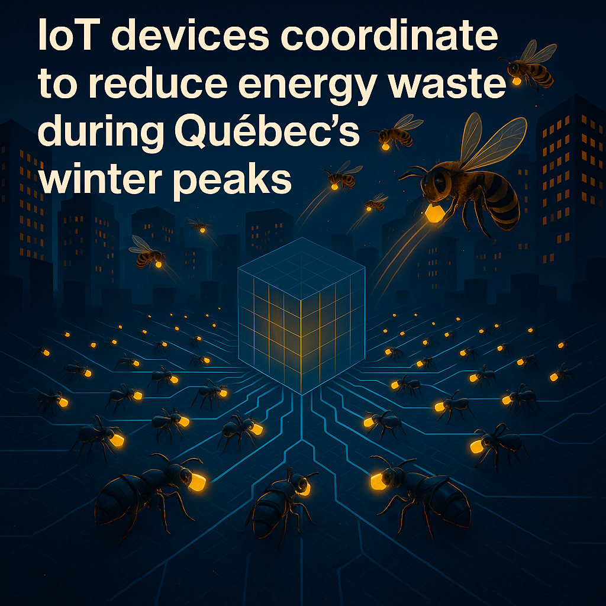

<p align="center">
  
</p>

# 🧠 IoT Modular Platform

**A scalable and modular IoT gateway architecture built on ESP-IDF**, designed for both local mesh networks and cloud-connected systems.  
The project evolves from simple prototypes into a full-fledged industrial IoT ecosystem integrating multiple communication protocols and smart control layers.

[](https://idf.espressif.com/)
[](https://www.docker.com/)
[](#)
[](#)

---

## 🚀 Overview

This repository hosts the **core firmware** and supporting tools for a modular, multi-protocol IoT platform.  
Each ESP32-based node can act as:
- a **Sensor Node (Leaf)** – collects and transmits data,
- a **Repeater Node (Parent)** – routes packets within mesh networks,
- or a **Gateway Node (Root)** – bridges the mesh to the cloud via MQTT/TLS.

The firmware runs on **ESP-IDF (FreeRTOS)** and communicates with AWS IoT Core or similar cloud services, supporting multiple transport layers such as Wi-Fi, BLE, Zigbee, Modbus, and BACnet.

---

## 🧩 Architecture

### Layered Design Philosophy

| Layer | Language | Responsibility |
|-------|-----------|----------------|
| **Core Layer** | C | Low-level hardware control, FreeRTOS task management, memory and network drivers |
| **Abstraction Layer** | C++ | Modular architecture (Wi-Fi, BLE, Zigbee, MQTT, OTA, Storage, Sensor Manager) using SOLID principles |
| **Tooling Layer** | Python | ESP-IDF build system, Docker environment setup, automation scripts, and CI/CD support |

### System Diagram
```
                   ┌──────────────────────────┐
                   │        AWS / Cloud       │
                   └───────────┬──────────────┘
                               │ MQTT/TLS
                      ┌────────┴────────┐
                      │  Gateway Node   │  ← Wi-Fi + Cloud
                      └────────┬────────┘
                               │ Mesh / BLE / Zigbee
     ┌─────────────────────────┼──────────────────────────┐
     │ Sensor Node A           │ Sensor B   │ Sensor C    │
     │ (temp, door)            │ (light)    │ (humidity)  │
     └─────────────────────────┴────────────┴──────────────┘
```

---

## ⚙️ Key Components

- **Wi-Fi Manager** – Handles STA/AP modes and automatic reconnection  
- **BLE / Zigbee Managers** – Discover and pair wireless sensors  
- **Modbus & BACnet Modules** – Industrial integration with BMS/HVAC systems  
- **MQTT Client** – Secure communication with AWS IoT Core  
- **OTA Manager** – Over-the-air firmware updates  
- **SD Storage Layer** – Local data buffering for offline operation  
- **System Monitor** – Power management, health metrics, and event logging  

---

## 🧠 Software Engineering Principles

The project follows strong engineering practices:
- **SOLID principles** for maintainability  
- **DRY** (Don’t Repeat Yourself) code reuse  
- **Event-Driven Architecture** using FreeRTOS queues and event groups  
- **Interface-based sensors and fieldbus drivers** for extensibility  
- **Abstraction-first design** enabling future Matter or Thread integration  

---

## 🧱 Repository Structure

```
/apps/iot_gateway
 ├── main/
 │    ├── app_main.c
 │    ├── wifi_manager.c/.h
 │    ├── mqtt_client.c/.h
 │    ├── sensor_manager.c/.h
 │    └── ota_manager.c/.h
 ├── components/
 │    ├── fieldbus/
 │    ├── network/
 │    ├── sensors/
 │    ├── storage/
 │    └── utils/
 └── Dockerfile / sdkconfig / CMakeLists.txt
```

---

## 🧪 Build & Flash

### 1. Clone the Repository
```bash
git clone https://github.com/madeli64/IoT-Modular-Platform.git
cd IoT-Modular-Platform/apps/iot_gateway
```

### 2. Configure Target (ESP32-C3)
```bash
idf.py set-target esp32c3
```

### 3. Build Firmware
```bash
idf.py build
```

### 4. Flash to Board
```bash
idf.py -p <PORT> flash monitor
```

> 💡 Tip:  
> When using Docker, the build artifacts appear inside `/workspace/apps/iot_gateway/build` and sync with your local folder automatically.

---

## 🌐 Future Roadmap

- [ ] BLE Mesh & Zigbee integration  
- [ ] Modbus RTU/TCP fieldbus support  
- [ ] BACnet/IP gateway for building automation  
- [ ] AI/ML cloud inference feedback loop  
- [ ] Web dashboard for real-time monitoring  
- [ ] Power-aware task scheduling engine  

---

## 🧭 Vision

To build a **reliable, modular, and open IoT gateway framework** that bridges field devices and cloud intelligence.  
The system is designed to be adaptable, from smart home sensors to large-scale energy management in commercial buildings.

---

## 👨‍💻 Author

**Mohsen Adelimoghaddam**  
System Solution Analyst / IoT Architect  
Montréal, Canada  

📧 mohsenadeli2024@hotmail.com  
🌐 GitHub: [madeli64](https://github.com/madeli64)  
🔗 LinkedIn: [Mohsen Adelimoghaddam](https://www.linkedin.com/in/mohsen-adelimoghaddam)
